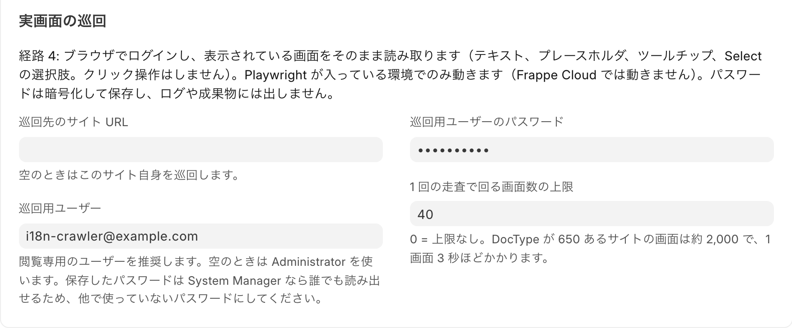
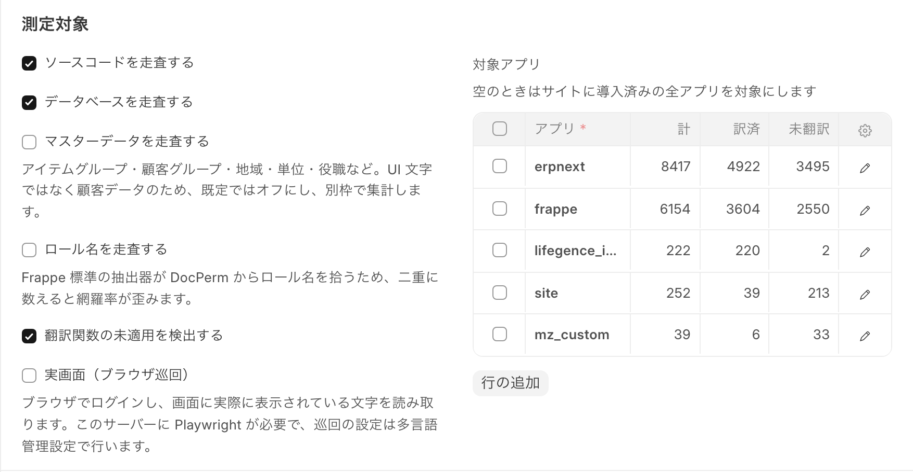
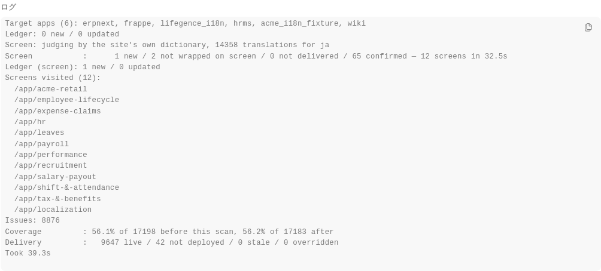
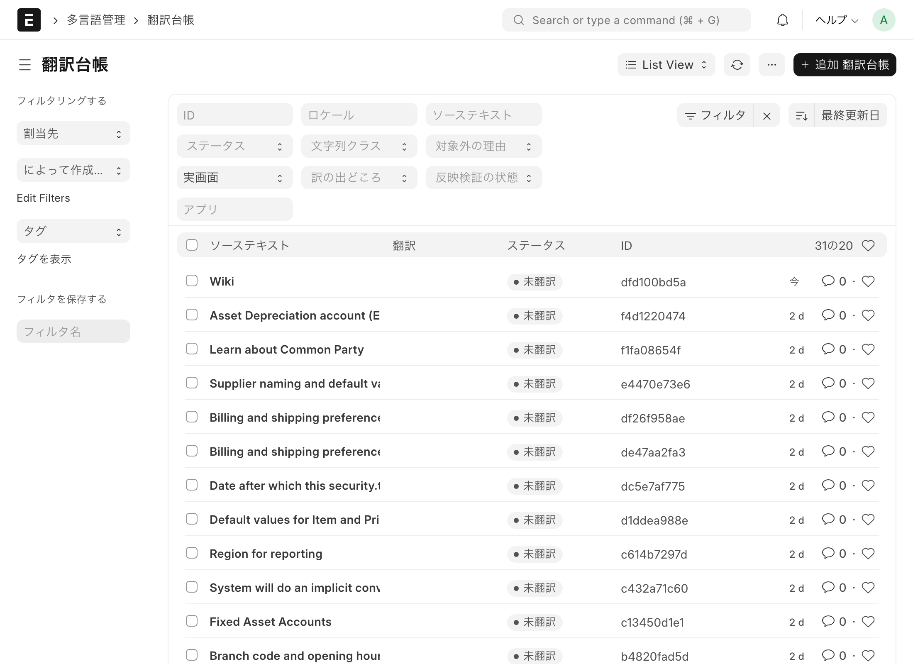
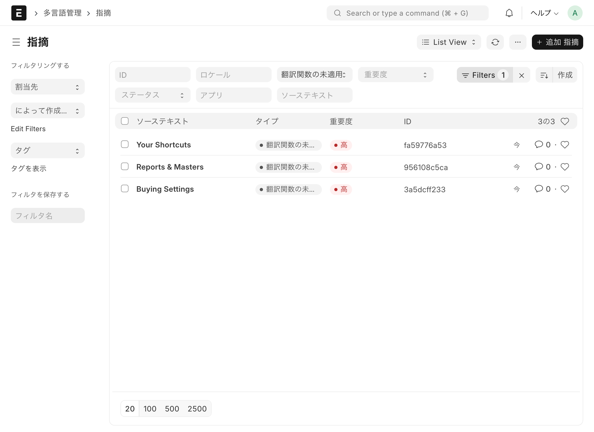
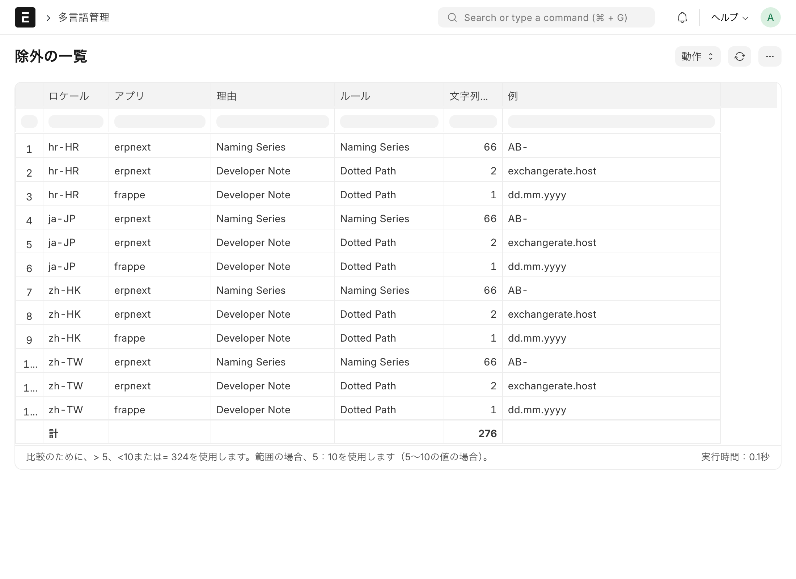

# I18n Manager — user manual

**lifegence_i18n 0.1.0 · 18 September 2026**

For Frappe / ERPNext version-15 and version-16.

> **New to Frappe or ERPNext? Start at chapter 0.** It explains the vocabulary
> the rest of the manual uses.

---

## 0. Read this first

### In three lines

1. An ERPNext screen keeps English on it that nobody has translated. The
   standard tools cannot tell you how much, and cannot help you fix it.
2. This app **finds that English four different ways, hands it out as a
   spreadsheet, takes the translations back, and delivers them — to this site,
   and into the files an application ships.**
3. **Writing the translations is the one step it does not do.** That is a
   person, an agency or a machine, working on the CSV the app hands out.
   Everything before and after is here.

### Words used in this manual

| Word | What it is |
|---|---|
| **Frappe** | The framework business applications are built on. ERPNext and this app both run on it |
| **ERPNext** | The business system built on Frappe — accounting, stock, selling, manufacturing |
| **This app** | Another application on Frappe. It measures the state of translation |
| **DocType** | One kind of record: a form and a database table together. Translation Entry and Locale Profile are each a DocType |
| **Workspace** | An application's front page. This app's is `/app/localization` |
| **Locale** | Country, language, currency and the date and number formats, as one setting. `ja-JP` is Japan, Japanese, yen. **Everything starts here** |
| **Source string** | The English a translation is made from. In Frappe the source string is itself the key a translation is looked up by |
| **Translation ledger** | One row per source string. The centre of this app |
| **Route** | A way of finding untranslated text. There are four: source code, database, outside a translation function, and the rendered screen |
| **Scan** | One run of those routes. Each run leaves a record |
| **Coverage** | The share of target strings that have a translation |
| **Delivery verification** | Whether an approved translation actually reaches the screen |
| **Issue** | Something a check found — untranslated, a dropped placeholder, a glossary violation |
| **bench** | The command used on the server. **Not needed if you only use the screen.** Where it is needed this manual says so |
| **Playwright** | Software that drives a browser. The fourth route uses it |
| **Single** | A DocType with exactly one record, such as System Settings or I18n Settings. Frappe's own word |
| **Fallback** | Where to look when a language has no translation — Hong Kong falling back to Taiwan, say |
| **Cache** | Translations held briefly to make screens fast. A reason a file can change while the screen does not |
| **String class** | What a string is: interface text, a role name, or master data. Only interface text counts towards coverage |

### Try it first (30 minutes)

Running it once before reading makes the rest go faster.

| Step | Do this | Look at |
|---|---|---|
| 1 | Open `/app/localization` | Three number cards: ledger rows, untranslated strings, open issues |
| 2 | Open Locale Profile → `ja-JP` | Coverage near the top, what to measure near the bottom |
| 3 | Top right "…" → Run Scan | The scan record opens, status Running |
| 4 | Wait a few minutes, reload | Status Completed. **The Log field is the whole result** (chapter 5) |
| 5 | Open the ledger, filter status Untranslated | The rows with no translation yet. This is the daily workbench (chapter 9) |
| 6 | Open Issues, filter by type | What the checks found (chapter 7) |

Those six steps are the loop. Everything else — entering translations, applying
them to the site, running a review — hangs off it.

### How to read the rest

| Your role | Chapters |
|---|---|
| New to this | 1, 2, 3, 4, 5 in order |
| Measuring and translating day to day | 5, 6, 7, 9, 10, 11 |
| Running the server | those, plus 2, the server notes in 5-1, and 13 |
| Adding a country | 12 |

---

## 1. About this application

### What it does

**It measures, continuously, how far a Frappe or ERPNext site has been
translated into each of the languages it runs in, and finds what is missing.**

It is not a tool for translating. It is a ledger for **finding what has not been
translated, checking the quality of what has, and generating the files that
carry translations to where they are needed.**

### Why it exists

Frappe ships two things: `Translation` (a source string and its translation) and
`Language`. It does not ship:

- a ledger of what needs translating, and what state each string is in
- a glossary, or any check that one is followed
- a coverage figure
- detection of broken placeholders (`{0}` and the like)

The standard way to find untranslated text — the `bench get-untranslated`
command, run on the server — **reads only the strings in source code**. Anything
on screen that is stored in the database instead (onboarding steps, workspaces,
report names, notification subjects) is never found by it.

### What it does not do

| Out of scope | Note |
|---|---|
| Translating | People, or a translation process outside the app, write the translations |
| Machine or AI translation | A candidate for later |
| Translating print formats rendered by an external service | That service has to support it |

**This app does not replace looking at the screen.** Its worth is not in making
that unnecessary but in **narrowing down where to look, so that less is missed.**

---
## 2. How translation works in Frappe / ERPNext

This app sits **on top of** Frappe's translation machinery. To see what it adds,
it helps to know what is already there.

### 2-1. Where translations live

Three places.

| Where | What it is | Whose |
|---|---|---|
| PO / MO files | `<app>/locale/<lang>.po` → `sites/assets/locale/<lang>/LC_MESSAGES/<app>.mo` | The application (standard from v15) |
| CSV files | `<app>/translations/<lang>.csv` | The application (the older way, still read) |
| Translation records | The site's database | That one site |

### 2-2. The order they are resolved in

When `_("Save")` is called, Frappe has already built one dictionary per
language. It is stacked in this order:

1. Application translations for the parent language (each installed app in
   turn, CSV then MO)
2. Application translations for the language itself
3. Translation records for the parent language
4. **Translation records for the language itself**
5. Country names

**Later beats earlier.** Translation records come last, which is how a site can
reliably override what an application ships. This app's "Apply to Site" writes
there.

### 2-3. Falling back to a parent language

A language like `zh-TW` reads its parent `zh` first and lays `zh-TW` over it.
The parent is whatever precedes the `-` or `_`.

It is a useful mechanism that **does not reach sideways**. Hong Kong `zh-HK` has
`zh` (simplified) as its parent, and traditional `zh-TW` is a sibling it will
never consult. This app's Fallback Locale fills that hole.

### 2-4. The key is the source string itself

The dictionary is keyed by the source string, verbatim. With a context, the key
is `source:context`.

**The match is exact.** `"Save"` and `"Save "` — with a trailing space — are
different keys. This is the usual reason a translation that was entered does not
appear, and why this app checks for whitespace mismatches.

### 2-5. What becomes translatable

Anything passed through `_()` in Python or `__()` in JavaScript. On top of that,
these are translatable without anyone writing code:

- DocType labels, descriptions and Select options
- Page and Report names
- Workflow state names
- Custom field labels

And conversely: **a string handed straight to `frappe.throw("...")` is never
translated, in any language.** This app's Not Wrapped issue finds those.

### 2-6. The standard commands

```bash
bench generate-pot-file --app <app>      # extract source strings into a .pot
bench create-po-file <lang> --app <app>  # make a .po to translate
bench update-po-files --app <app>        # carry .pot changes into the .po
bench compile-po-to-mo --app <app>       # compile to .mo, which is what is read
bench get-untranslated <lang> out.txt    # list what is untranslated (CSV route)
```

**Both `generate-pot-file` and `get-untranslated` look only at source code.**
Display strings held in the database are outside their reach, which is why this
app has a database route.

### 2-7. How the display language is chosen

`User.language`, then the language in System Settings, then `en`. **Two people
can use the same site in different languages.**

### 2-8. Dates and numbers

**The formats belong to the Language record.** `date_format`, `time_format`,
`number_format` and `first_day_of_the_week` are fields on Language, read every
time something is displayed (falling back to the site default). This is why
"Apply to Site" writes to Language.

**Currency is independent of language.** Each Currency carries its own format
and number of decimals, and amounts are formatted from there. A document in US
dollars shows dollars on a Japanese screen. **A locale in this app keeps
language and currency as separate fields because Frappe keeps them separate.**

### 2-9. Cache

The per-language dictionary is held in Redis. After changing translations,
`frappe.translate.clear_cache()` is required — "Apply to Site" does it for you.

### 2-10. What Frappe does not have, and this app adds

| Question | Frappe | This app |
|---|---|---|
| Somewhere to put translations | Yes, three places | Uses them as they are |
| A ledger of what needs translating | **No** | Translation Entry |
| Untranslated strings in source code | Yes | The same route, written to the ledger |
| Untranslated strings in the database | **No** | The database route |
| Strings that never reach a translation function | **No** | The code-message route |
| A glossary, and a check that it is followed | **No** | Glossary Term |
| A coverage figure | **No** | Two of them |
| Placeholder, markup and whitespace checks | **No** | Translation Issue |
| Falling back to a parent language | Yes | Uses it as it is |
| Falling back to a sibling | **No** | Fallback Locale |
| Telling an inherited translation from an own one | **No** | Translation source: Own / Fallback / Inherited |

**This app does not replace Frappe's translation machinery.** Translations still
end up in ordinary Translation records and in files an application ships; this
app owns the ledger, the checks and the measurement that come **before** that.
Uninstall it and the translations already applied stay on the site.

---

## 3. What the screens are

The workspace is **`/app/localization`** — "Localization" in the app switcher.

> There is no `/apps/lifegence_i18n` URL. Frappe has no `/apps/<name>` route at
> all.

### The DocTypes

| DocType | Role |
|---|---|
| Locale Profile | Country, language, currency and display formats as one record. **Everything starts here** |
| Translation Entry | The ledger: one row per source string, with its translation, where it was found, and its status |
| Glossary Term | Per-locale terms, and wordings that must not be used |
| Translation Scan | One scan |
| Translation Issue | What the checks found |
| I18n Settings | Detection settings shared by every locale (a Single) |

### This app's own interface

**The app's own screens are built the way it asks you to build yours.**

- Field and button labels are written in **English**
- Japanese is supplied by `lifegence_i18n/translations/ja.csv`
- In any other display language the app **appears in English** — it does not
  stay Japanese

To add a language, add `translations/<code>.csv`. Exporting the app translation
CSV from the ledger produces exactly that format.

> **Which words are shipped is a decision, not an accident.** An application's
> translation CSV applies to the whole site, so shipping a general word like
> `Status` or `Draft` **rewrites it across all of ERPNext**. Where frappe or
> erpnext already translate a word, this app leaves it to them (about 70 words).
> Not competing with the core translations is the very problem this app detects.

### On the workspace

- **Number cards** — ledger rows, untranslated strings, open issues
- **Shortcuts** — locales, ledger, issues, glossary
- **Reports** — Localization Coverage, Localization Exclusions, Localization
  Delivery

---
## 4. Setting up

### 4-1. Shared settings

`/app/i18n-settings`

| Field | What it does | Default |
|---|---|---|
| Source Language | The language translations are made from | `en` |
| Create missing languages | Creates the `Language` record when a locale is saved | On |
| Enable missing currencies | Enables the `Currency` when a locale is saved | On |
| Minimum String Length | Anything shorter is not written to the ledger | 2 |
| Exclusion Rules (table) | Rules saying "text of this shape is not translated": name, pattern (a regular expression), reason code, auto-apply, enabled | 9 rules including naming series. Only "acronym" has auto-apply off — it proposes a reason rather than applying one |
| Terms Allowed in Latin Script | Brand names, units, abbreviations. One per line | Acme, ERPNext, SKU, kg, … |
| **Screen Crawl** (section) | Route 4. See 5-1 | — |
| Site URL to Crawl | Where to crawl. Empty means this site. Another site must be https, and needs `i18n_allow_remote_crawl` in site_config.json | Empty |
| Crawl User | **Make a read-only user for this.** Empty means Administrator. Set its language to the locale's, and exempt it from two-factor authentication and password expiry | Empty |
| Crawl User Password | Stored encrypted and kept out of logs and exports. Frappe does let any System Manager read a stored password back, so **use a password used for nothing else** | — |
| Max Screens per Scan | Stops at the limit. **0 means no limit** — about 2,000 screens, 1.8 hours | 300 (provisional) |



**Grow the allowed-Latin list as you go.** At first the "Latin residue" check
reports a lot. Every brand name or abbreviation you add takes some off.

### 4-2. Creating a locale

`/app/locale-profile/new`

**Four fields are required.**

| Field | Japan | Croatia |
|---|---|---|
| Locale Code | `ja-JP` | `hr-HR` |
| Country | Japan | Croatia |
| Language | ja | hr |
| Currency | JPY | EUR |

The locale code is BCP-47 (`language-COUNTRY`) and becomes the record's name.

**Saving does the rest automatically.**

- Creates the `Language` record if missing, enables it if disabled
- Enables the `Currency` if disabled
- Decides from the language code **whether the language is written in Latin
  script**
- Looks up the time zone from the country

#### Display formats

| Field | Note |
|---|---|
| Date format | Varies by country: Japan `yyyy-mm-dd`, Hong Kong `dd/mm/yyyy`, Croatia `dd.mm.yyyy` |
| Number format | **Croatia is `#.###,##`** — comma for the decimal point and full stop for thousands, the opposite of Japan |
| Decimal places | **Zero for the yen**, which has no subunit |
| First day of the week | Sunday in Japan, Taiwan and Hong Kong; Monday in Croatia |

#### Fallback locale

A fallback is **where to look when this language has no translation**. Hong Kong
(traditional Chinese) falling back to Taiwan (also traditional), for instance.

**Set Hong Kong `zh-HK` to fall back to Taiwan `zh-TW`.** Frappe drops
automatically to the parent of the language code, `zh`, which is simplified.
What Hong Kong needs is traditional, and `zh-TW` is a sibling rather than a
parent, so **Frappe will never take that path on its own.**

Translations are then resolved in this order:

| | Where from | Shown in the ledger as |
|---|---|---|
| 1 | This language code's own translation | `Own` |
| 2 | The fallback locale's ledger (chained, up to five deep) | `Fallback` |
| 3 | Whatever Frappe currently resolves, inheritance from a parent included | `Inherited` |

**Only what the fallback holds as its own, or as its own fallback, is taken.**
Most of Taiwan's ledger is inherited from simplified Chinese, and passing that
along to Hong Kong would turn something merely inherited into what looks like a
deliberate translation.

**Order matters when scanning.** Hong Kong reads Taiwan's ledger, so Taiwan has
to be measured first. Scheduled scans work the order out for themselves.

#### What to measure

| Field | What it covers |
|---|---|
| Scan source code | Translatable strings in `.py`, `.js` and `.json` |
| Scan the database | Strings that appear on screen and are not in code |
| Scan master data | Item group names and the like. Customer data, so off by default |
| Scan role names | Off by default, to avoid counting them twice |
| Screens (browser crawl) | Route 4 (section 5-1). Off by default |
| Detect strings outside a translation function | Literals handed to `frappe.throw` and friends |
| Target applications | **Empty means every application installed on the site** |

**About applications installed later.** If the target list is empty, a new
application **is measured from the next scan onwards**. Nothing needs changing.

If the list names applications explicitly, a new one stays outside it. **That
state is listed in every scan log as `NOT MEASURED (N): ...`** — so that a high
coverage figure cannot quietly coexist with a whole application nobody is
measuring.

> Only applications **installed on that site** can be measured. One sitting on
> the server without being installed cannot (for whoever runs the server: this
> means `bench install-app` has been run).

---

## 5. Measuring

Open a locale and press **Run Scan**.

It runs in the background and the scan record opens. The status goes **Queued →
Running → Completed**, and the screen refreshes itself when it finishes.

> For scale: 23 installed applications and 22,526 strings take about 35 seconds.

### Reading the scan record

> While a scan of the same locale is running, pressing Run Scan again does
> nothing — it says the earlier scan is still running. Wait for it.

| Field | Meaning |
|---|---|
| Total / translated / untranslated / coverage | The whole ledger for that locale |
| New | Strings found for the first time |
| Updated | Strings whose current rendering changed |
| Issues | Issues raised by this scan |
| Breakdown | Application × route × string class. **The most useful part** |
| Log | Counts and timings per route |

### How a scan writes to the ledger

A scan **does not overwrite.**

- A string seen for the first time is added
- **A row with no translation takes whatever Frappe currently resolves** and is
  marked Approved
- **A row that already has a translation is left alone**

So the ledger does not start empty. It starts as a picture of where the site
already is.

### 5-1. The screen crawl, the fourth way of looking

**Why a fourth is needed.** The other three — source code, database, outside a
translation function — are ways of collecting the strings that *ought* to be
translated. **None of them ever looks at a screen.** So these stay in English
and none of the three finds them:

- A workspace heading, because it is buried inside a JSON blob in the data
- The count format on a shortcut, `{} Open` and the like
- A button label that never went through the translation machinery

The fourth route **drives a browser, logs into the site, opens the screens one
by one and reads the text actually shown.** Think of it as standing in for a
person looking at every screen.

#### Using it

1. Put a crawl user and password into the Screen Crawl section of I18n Settings
   (section 4-1)
2. Tick "Screens (browser crawl)" in the locale's list of what to measure
3. Press Run Scan. The crawl begins after the other three finish



#### Which screens it visits

In this order, stopping at the configured limit:

1. Public workspaces — each application's front page
2. Settings screens with a single record (System Settings, Selling Settings —
   Frappe calls these Singles)
3. For each DocType of the target applications: the list, a blank form, and one
   existing record

**Site-specific applications first, frappe and ERPNext last**, so that when the
limit cuts the crawl short, the screens the other routes cannot see have been
seen. A public workspace made by hand in the browser — belonging to no
application — comes before all of them.

An administrator can reach about 2,000 screens, at a little over three seconds
each. A limit of 300 takes roughly 15 minutes.

#### Reading the result

The scan log gains lines like these:

```
Screen: judging by the site's own dictionary, 31842 translations for ja
Screen           :     30 new / 4 not wrapped on screen / 2 not delivered / 294 confirmed — 40 screens in 138.4s
Not delivered to the site (2): translated in the ledger, not served by the site
  'Export' on /app/data-export
  'Quick Access' on /app/selling
Ledger (screen): 30 new / 0 updated
Screen normalised: '4 To Receive' -> '{0} To Receive'
Screens visited (40):
  /app/selling
  /app/item
  …
```

| In the log | What it means | What to do |
|---|---|---|
| `(N could not be opened)` | Appears at the end of the summary: screens the crawl user could not open | Below it, `Screen: could not open …` gives the reasons and `Screens not opened: …` names them. If it is permission, revisit the crawl user's |
| `30 new` | 30 English strings the other three did not know | Filter the ledger by Found In = Screen and **translate them** (chapter 9) |
| `judging by the site's own dictionary, … for ja` | Judgement used the translations the crawled site serves. What follows `for` is the crawl user's display language | When crawling from another machine, judgement still uses the crawled site's translations (end of this section) |
| `4 not wrapped on screen` | Four strings where a translation exists, the site serves it, and the screen shows English anyway | Filter issues by Not Wrapped and look at those whose detail starts `screen:`. **Translating will not fix these. Ask a developer to fix the code** |
| `2 not delivered` | Two strings approved in the ledger that the site does not serve — not shipped, or shipped stale. The list follows the summary line, up to 40 | Ship the translations (chapter 11). No developer needed |
| `294 confirmed` | Ledger gaps confirmed as English on a screen | Nothing. It corroborates the measurement |
| `40 screens in 138.4s` | 40 screens in 138.4 seconds | Useful for setting the limit |
| `Ledger (screen): 30 new` | 30 rows were added to the ledger | — |
| `Screen normalised: …` | A string with a count in it ("4 To Receive") was stored as a template ("{0} To Receive") | — |
| `Screens visited (40):` | Where the crawl went. A record's screen is recorded as `/app/<DocType>`; the record's name is not kept | Check the crawl's reach |

Other lines you may see:

| Line | Meaning |
|---|---|
| `(3 could not be opened)` at the end | Three screens could not be opened — no permission, no such page. The visited list shows which |
| `Screen : not run — …` | A setting was wrong and the crawl could not run. **The other three routes keep their results** |
| `Screen : skipped — Playwright is not installed…` | Playwright is not on this server. As above |
| `Claimed from site: 109 (acme_erp 87, erpnext 22)` | 109 ledger rows whose owner was "site" — no application identified — were reassigned to the application this scan identified, broken down by application. Any route can produce this, not just the screen crawl |



New rows can be found in the ledger by filtering Found In = Screen. Each row's
location says which screen it came from (`/app/assets` and so on; a record's
screen is recorded as `/app/<DocType>` without the record's name).





#### How product and customer names avoid being called untranslated

A screen mixes text that should be translated — buttons, labels — with text that
must not be: product names, customer names, codes. This app tells them apart
**by where they sit on the page, never by how they look.**

| Excluded as data | Example |
|---|---|
| Field values, list rows, grid rows, trees, charts, the timeline | "Bath Bomb Sea Salt", "Acme Trading Co." |
| The record name in the URL | the second half of `/app/customer/Acme Trading Co.` |
| Master names — companies, warehouses, accounts, item groups | "Nagoya Depot" |
| Installed application names, the signed-in user's own name | "erpnext", "Crawler Sales" |

Text that **is translated as one string but drawn as several** — a description
or an HTML field that renders as a heading, a paragraph and a list — does not
produce a new gap per line. Translating the original changes the whole thing.

Text containing Japanese is taken as translated. The same exclusion rules apply
as on the other routes, naming series included. An acronym — an all-capitals
word like SKU — is given "acronym or code" as a proposed reason and keeps
counting as untranslated until somebody confirms it.

#### The crawl sees only what the crawl user can open (important)

The crawl logs in as the user you name and opens screens as them. **A DocType
that user cannot read cannot be opened** — Frappe answers "not found". If you
make a read-only user, give it **read permission on the DocTypes of every target
application**. Without that, the screen is counted as not opened and is not
measured. Measuring public applications with an under-permissioned user left 324
of 400 screens unopened, and the log said:

```
Screen: could not open 324 of 400 — 324 x not available to the crawl user (no permission, or no such page)
```

If you see that line, revisit the crawl user's permissions. The tighter they
are, the fewer screens can be measured.

#### About the crawl user (important)

**Strongly consider making a read-only user for this.** Left empty, the crawl
runs as Administrator.

The reason is that in Frappe anyone with System Manager can read a stored
password back as plain text. Put the Administrator password here and every
administrator can see it.

A crawl user needs only permission to **look**. Also make sure that:

- its display language is the locale's language
- it is exempt from two-factor authentication and password expiry
- its password is used for nothing else

Login and view history will be recorded under this user's name, which is another
reason to keep it separate: it is easy to filter out afterwards.

#### What it does not pick up

- **Anything that needs a click.** The first version reads the screen as it
  stands — it does not open menus or filters, save, or work dialogs (under
  consideration for the next). Errors raised on save are covered by the Not
  Wrapped issue instead
- The day names in the date picker, because frappe itself has no dictionary for
  them; a translation file will not fix it

#### For whoever runs the server

Route 4 needs Playwright. Once, on the server:

```bash
./env/bin/pip install playwright
./env/bin/playwright install --with-deps chromium   # needs administrator rights
```

**It cannot be installed where you cannot run commands, such as Frappe Cloud.**
There the log simply says `Screen: skipped` and the other three routes run
normally. From another machine — a development machine or a verification server
with Playwright — put the target site's URL and credentials into *that*
machine's I18n Settings and run:

```bash
bench --site <site> execute lifegence_i18n.scanner.screen.run --kwargs '{"locale": "ja-JP"}'
```

In that arrangement **the findings are recorded on the machine that ran the
scan**, not in the target site's ledger.

The dictionary that judges is the one **the crawled site** serves to the crawl
user, read once just after login (the `judging by the site's own dictionary`
line). The two machines need not carry the same translation files. Anything the
ledger has translated and the crawled site does not serve is counted as `not
delivered` and listed in the log. [`remote-crawl.md`](remote-crawl.md) has the details.

The URL has rules. To crawl anything other than your own site it must be https,
must not be an internal address, and needs `i18n_allow_remote_crawl` in
`site_config.json`. This is where the browser posts a stored password, so the
restriction is there to stop it being posted somewhere unintended.

---
## 6. Reading the result

`/app/query-report/Localization Coverage` — "Coverage" on the workspace.

Totals, translated, untranslated and coverage, by locale × application × route ×
**string class**. Only the Interface Text rows count towards the headline
coverage. Role Name and Master Data rows appear separately for reference (both
are off by default, so usually they do not appear at all).

`/app/query-report/Localization Exclusions` — "Exclusions" on the workspace —
lists everything ruled out, by locale × application × reason × rule, with counts
and examples. It exists to answer "why is this not being translated?".



### There are two coverage figures

| Column | Meaning |
|---|---|
| **Displayed coverage** | The share that shows *some* translation. **Inheritance from a parent language is included** |
| **Own coverage** | Only this locale's own translations — its own and its fallback's |
| Inherited from the parent | The difference between them |

**They can be far apart.**

| Locale | Displayed | Own |
|---|---:|---:|
| ja-JP | 88.4% | 88.4% |
| hr-HR | 73.4% | 73.4% |
| zh-TW | **71.7%** | **13.9%** |
| zh-HK | **71.7%** | **13.9%** |

For traditional Chinese, 71.7% is not the truth. **The other 57.8% is showing
simplified Chinese.** In the Chinese-speaking world it is the own-coverage
figure that can be acted on.

Japanese and Croatian have no parent language, so their two figures agree.

### Always look at the routes separately

Measured on a reference site, in Japanese:

| Route | Application | Coverage |
|---|---|---:|
| Source code | frappe | 96.5% |
| Source code | erpnext | 98.4% |
| **Database** | **erpnext** | **13.6%** |
| **Database** | **hrms** | **4.4%** |

**Measured with the standard tools alone, only source code is visible, and the
site looks 98% done.** Not one of the display strings held in the database has
been counted.

---

## 7. Working through the issues

`/app/translation-issue` — "Issues" on the workspace.

Filter by locale, type, severity and status.

### The types

| Type | Severity | Meaning | What to do |
|---|---|---|---|
| Untranslated | Medium | No translation | Write one |
| Placeholder Mismatch | High | `{0}` or `%s` dropped or added | **Fix it.** At run time the value will not appear |
| HTML Mismatch | High | A tag dropped or added | **Fix it.** The layout breaks |
| Glossary Violation | Low | A wording that differs from the glossary | Check, and replace in bulk if needed |
| Forbidden Term | High | A wording ruled out is present | Fix it |
| Latin Residue | Low | Latin script left in the translation | Translate it, or add it to the allowed terms |
| Unreachable Whitespace | Medium | The source string has surrounding whitespace, so Python's translation function cannot reach it | Re-key it without the whitespace |
| Not Wrapped | High | Handed straight to `frappe.throw` or similar | **The source code has to change** |
| Not Wrapped, detail starting `screen:` | High | The site has the translation and the screen still shows English. The code that draws it does not go through a translation function | **The source code has to change** (section 5-1) |

### About Not Wrapped

> **A row whose detail starts `screen:` was found by the screen crawl.** The
> site holds the translation and the screen shows the source, and **because of
> how Frappe works, putting a translation in the ledger will not change it.**
> The code that draws it has to change — frappe itself, or an application's
> workspace rendering. Measuring public applications turned up three shapes:
>
> - A workspace heading, drawn straight from the content JSON without translation
> - A button label, set without `__()`
> - A form field label, from a definition created in English and still cached

This issue does not say a translation is missing. It says **the translation
files cannot reach where the string is.**

```python
frappe.throw("Invalid Name")  # ← no translation applies
frappe.throw(_("Invalid Name"))  # ← a translation applies
```

No amount of translating fixes it; the application's source has to change. An
f-string (`f"{x} updated"`) has to become `_("{0} updated").format(x)`.

### About Unreachable Whitespace

**Frappe matches source strings exactly.** A string with a trailing space is a
different key from the same string without one. This is the usual reason a
translation that was entered does not appear.

### About Latin Residue

**It switches itself off for languages written in Latin script**, because
running it against Croatian or German would flag every row. The locale's "Latin
script" field decides.

### Issue status

| Status | Meaning |
|---|---|
| Open | The default |
| Not Applicable | **This judgement survives the next scan** |
| Resolved | Recreated by the next scan |

**Issues are derived data.** Every scan rebuilds everything except Not
Applicable. To keep a judgement, mark it Not Applicable.

---

## 8. Using a glossary

`/app/glossary-term`

| Field | What it does |
|---|---|
| Locale | A glossary belongs to one locale |
| Source Term | `Customer`, say |
| Translated Term | `得意先`, say |
| Do not translate | Brand names and the like. Checks that **the source is showing through unchanged**. On top of that, a row whose whole source string is just this term — a select option reading "Acme ERP", say — is written by the scan as Not Applicable with the reason "brand or product name", and exported into the app CSV with the source as its own translation |
| Match type | Word (not adjoining a letter) or substring |
| Case sensitive | On by default |
| Record violations as issues | Off means the term is kept for reference and not checked |
| Forbidden terms | One per line. Any that appears raises a High issue |

**The forbidden list does the work.** Decide on `Customer → 得意先`, put `顧客`
in the forbidden list, and every mixture of the two is caught.

---

## 9. Entering and correcting translations

### 9-0. How status moves (read this first)

```
Untranslated ──enter a translation──▶ Draft ──approve──▶ Approved ──"Apply to Site"──▶ on screen
                       import a review sheet ──▶ Reviewed ──┘
```

**"Apply to Site" writes only Approved and Reviewed rows. Drafts are not
applied.**

Editing a translation on screen sets the row to Draft. Applying to the site then
**will not put that translation on screen.** If drafts remain when you apply,
the app says how many:

> Applied
> 12 new / 3 updated
> **5 translations stayed as drafts and were not applied. Use Actions → Approve
> Drafts.**

**Actions → Approve Drafts** approves every draft in that locale at once, after
showing you the count.

The draft stage exists because **a translation somebody typed and a translation
somebody agreed to are different things.** If applying doubled as approving,
that difference would disappear.

### 9-1. One at a time

The ledger (`/app/translation-entry`), filtered by locale and status
Untranslated, is the everyday workbench. Filtering by "has issues" picks out
rows that have a translation and a problem with it.

Open a row and edit the translation. The status follows:

- entering a translation moves Untranslated → Draft
- clearing it moves back to Untranslated

**For bulk edits**, select rows in the list and use bulk edit to change status.
For entering many translations at once, the next two sections are better.

### 9-2. Importing a CSV

The ledger supports Frappe's standard **Data Import**.

1. List → menu → **Import**
2. Choose Update, and load a CSV with `ID` and `Translation` columns
3. Imported rows become Draft → **Actions → Approve Drafts**

This is the shortest path when a translation agency is doing the work in bulk.
The IDs are in Export → Review Sheet (CSV).

### 9-3. Adding a string by hand

To manage a string no scan will find — wording from an external service, say —
create a ledger row. **Locale, source string and translation** are required. Its
origin is recorded as Manual.

**The same locale, source string and context cannot be entered twice.** The
error links to the existing row.

### 9-4. Changing a term everywhere

Open the locale and choose **Actions → Replace Term**.

1. Enter the old and new wording and press Preview
2. **The count, and a before-and-after for each row, appear before anything
   changes** (the first 200)
3. Check, then Apply

**How many rows a glossary decision moves is visible before it is made.**

---

## 10. Running a review

### 10-1. Exporting

Open the locale and choose **Export → Review Sheet (CSV)**.

| Column | Contents |
|---|---|
| ID | The ledger row's ID. **Do not edit it** |
| App / Found In / Status | For reference |
| Source Text / Context / Translation | As they stand |
| Issues | What the checks found |
| **Proposed Change** | **For the reviewer** |
| **Reviewer Comment** | **For the reviewer** |

Written as UTF-8 with a byte-order mark, so Excel opens it correctly.

### 10-2. Importing

Attach the filled-in file with **Import File → Review Sheet (CSV)**.

- **Only rows with something in Proposed Change** are applied, and they become
  Reviewed
- Blank rows are left alone. **Returning a sheet half finished is safe**
- A row whose ID is not in this locale is counted as skipped and reported — so
  that loading the wrong locale's sheet is noticed

---

## 11. Applying to the site

Open the locale and choose **Actions → Apply to Site**.

Two things happen:

1. **The display formats are written to the `Language` record** — date format,
   number format, first day of the week. This is where Frappe reads them
2. **Approved and Reviewed translations are written as `Translation` records**

Frappe resolves in the order app CSV → app MO → Translation record, and **the
last wins**. So this can override what an application ships.

> **A translation identical to what is already displayed creates no record**, to
> avoid swelling the site with records that change nothing.

### Delivery verification

Every scan decides, for each Approved and Reviewed row, whether that translation
is on the screen right now, and writes the answer to the ledger's Delivery
column and to the Localization Delivery report. It reads the files **bypassing
the cache**, because two states that look identical in a browser — still English
— have different fixes.

| Delivery | Meaning | Fix |
|---|---|---|
| Live | The screen shows that translation | — |
| Cache Stale | The file has it and the site is serving something older | `bench clear-cache` |
| Not Deployed | **No application's file has it** — not exported, not imported, not installed. It is still this even if an older translation or Frappe's own is on screen | Export it and put it in place |
| Overridden | An application's file has it, and a file read later, or a Translation record, wins | Find what is winning |

**For example.** Change "Return Reason" in the ledger from 返品理由 to 返品の理由
and approve it: the files still hold only 返品理由, so it is **Not Deployed**.
Export the CSV into the application and it becomes **Cache Stale** until the
cache is cleared, then **Live**.

### Exporting the app CSV

**Export → App Translation CSV**, then choose an application, produces exactly
the `<app>/translations/<lang>.csv` format. It can be committed to the
application's repository as it is.

**Rows whose translation equals the source are left out.** Frappe resolves to
the source anyway, and they only make the diff harder to read. These rows are
written, though, as the record of a decision not to translate (and stop being
reported as gaps):

- rows marked Not Applicable with the reason "brand or product name" or "acronym
  or code"
- rows matching a glossary term marked do-not-translate

**Columns**: a row with no context is written with two, a row with one with
three. Re-exporting over an existing two-column file does not rewrite every
line.

**Writing straight into the application's folder (for whoever runs the
server)**: ticking "also write into this bench's app translations folder" in the
dialog writes the same content into that server's
`<app>/translations/<lang>.csv` as well as downloading it, so a developer can
commit it from there. It cannot be used where the server's files are out of
reach, such as Frappe Cloud — the download still works.

---

## 12. Adding a country

**The locales you start with are not fixed.**

Enter four fields at `/app/locale-profile/new` — locale code, country, language,
currency — save, and press Run Scan.

It can also be done from code (for whoever runs the server):

```python
from lifegence_i18n.localization.doctype.locale_profile.locale_profile import add_locale

add_locale(
	country="Korea, Republic of",
	language="ko",
	currency="KRW",
	locale_code="ko-KR",
)
```

**A language with no translations at all reports 0% coverage.** That is the
right place to start from: how much there is to do is a number on day one.

---

## 13. Scheduled scans

`hooks.py` registers a weekly scan of every enabled locale.

**New strings keep arriving for as long as development continues.** This is not
a thing you measure once; it is built on the assumption that the number keeps
moving.

To run it by hand:

```python
from lifegence_i18n.localization.doctype.translation_scan.translation_scan import run_scheduled_scans

run_scheduled_scans()
```

---

## 14. Appendix: the values

### Ledger status

| Value | Meaning |
|---|---|
| Untranslated | No translation |
| Draft | A translation was entered and has not been agreed |
| Reviewed | It went through a review |
| Approved | Settled. Translations picked up by a scan land here too |
| Not Applicable | **Excluded from the totals** |

### Reasons for Not Applicable

| Value | What applies it |
|---|---|
| Naming Series | A default exclusion rule — numbering formats like `SO-.YYYY.-` |
| Acronym or Code | The default "Acronym" rule. **Auto-apply is off**, so the reason is proposed and the status stays Untranslated until a person confirms it |
| Role Name | Rows that entered the ledger as role names (string class `Role Name` too) |
| Master Data | Rows that entered as the name of a master record |
| Brand or Product Name | Rows whose **whole source string** matches a glossary term marked do-not-translate |
| Developer Note | A default rule — URLs, dotted paths, expressions beginning `eval:`, paths beginning `/api/`, colour codes like `#f5f5f5` |
| Placeholder Only | A default rule — strings with no sentence in them, `{name}` or `<br>` |
| Manual | Set by a person. **A scan will not clear it** |

### Where a ledger row was found

| Value | Meaning |
|---|---|
| Source Code | Found in `.py`, `.js` or `.json` |
| Database | Found in the site's records |
| Code Message | A string that never went through a translation function |
| Screen | Found by the browser crawl (section 5-1). The location holds the screen's address |
| Manual | Added by hand |

### Where a translation came from

| Value | Meaning | Counts as own coverage |
|---|---|---|
| Own | This language code's own translation | Yes |
| Fallback | Taken from the fallback locale | Yes |
| Inherited | Frappe inherited it from the parent language | No |
| (empty) | No translation | No |

### Scan status

Queued → Running → Completed / Failed.

A failure leaves the traceback in the Log field.

---

## 15. When something goes wrong

| Symptom | Cause and fix |
|---|---|
| The scan stays Queued | The background worker is not running. Ask whoever runs the server to check (`bench start`, or the worker's state) |
| Coverage is higher than expected | Check whether the target applications are narrowed, and whether "scan the database" is off |
| A translation was entered and does not appear | 1. **Is it still Draft?** (section 9-0) 2. Was Apply to Site run? 3. Does the **whitespace around the source string** match? |
| The display language changed and the ledger's translations do not show | **Apply to Site has to be run per locale.** A translation in the ledger alone changes nothing on screen |
| Switching to Hong Kong shows simplified Chinese | Scan Taiwan, then Hong Kong, then **Apply to Site for Hong Kong**, in that order |
| Latin Residue reports a great deal | Add brand names and abbreviations to "Terms Allowed in Latin Script" in I18n Settings |
| A locale will not save because the language is missing | "Create missing languages" is off in I18n Settings |
| A row with the same source string will not save | The same locale and context cannot be entered twice. Edit the existing row |

---

## 16. Said plainly

- **Latin Residue reports a lot and is not usable as it stands.** It assumes you
  will grow the allowed-terms list. It is a list of things to look at, not a
  list of errors.
- **The screen crawl sees only the screens it opened.** Wording that appears
  after a click, and fields hidden by permission, are not picked up. It also
  needs an environment with Playwright.
- **Only applications installed on the site can be measured.** Strings in an
  application that is not installed cannot be.
